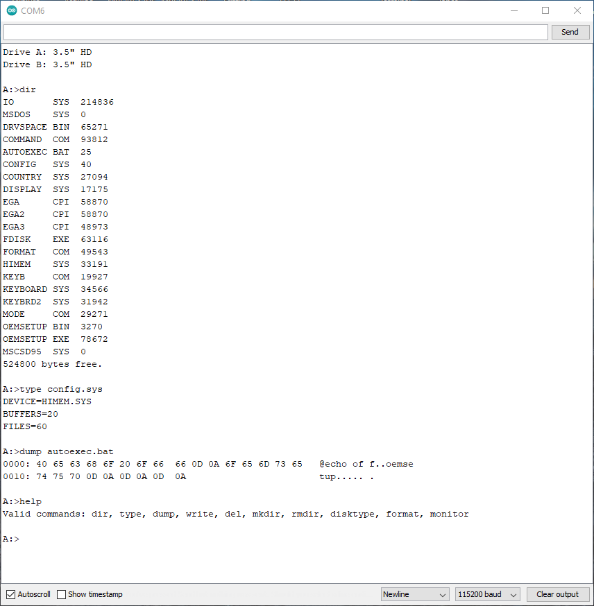

# ArduinoFDC

ArduinoFDC is a sketch that implements a floppy disk controller. It works with Arduino Uno, Leonardo, Nano, Pro Mini, Micro and Mega.

ArduinoFDC consists of three parts: 

1. A [library](#library-functions) providing low-level functions to allow reading and writing disks at the 
sector level as well as low-level formatting disks.
2. Integration of ChaN's brilliant [FatFS](http://elm-chan.org/fsw/ff/00index_e.html)
library to provide file-level functions for reading and writing files and directories
in a FAT (MS-DOS) file system and a high-level format function to initialize a FAT file system.
3. An example sketch implementing [ArduDOS](#ardudos), a (very) small DOS environment for browsing
a FAT file system as well as a [low-level disk monitor](#low-level-disk-monitor) to access sector data on the disk,
including the ability to transfer whole disks or single files via the XModem protocol.

ArduinoFDC works with double density (DD) as well as high density (HD)
disk drives. It can read, write and format 5.25" DD (360KB), 5.25" HD (1.2MB), 3.5" DD (720KB)
and 3.5" HD (1.44MB) disks.

## Wiring

The table below shows how to wire the Arduino pins to the 34-pin IDC
connector on the floppy drive cable.

The pin numbers are defined at the top of the ArduinoFDC.cpp file. Some of them can 
easily be changed whereas others are hard-coded in the controller code. Refer to 
the comments at the top of the ArduinoFDC.cpp file if you want to use different
pin assignments.

Floppy Cable     | Uno/Mini/Nano | Leonardo/Micro  | Mega   | Notes  | Function
-----------------|---------------|-----------------|--------|--------|---------------
2                | 13            | 13/16           | 42     | 3,4,5  | Density select
8                | 7             | 8               | 47     |        | Index
10               | 4             | 5               | 51     | 1,3    | Motor Enable A
12               | A1            | A1              | 40     | 1,3,4  | Drive Select B
14               | 5             | 6               | 50     | 1,3    | Drive Select A
16               | A0            | A0              | 41     | 1,3,4  | Motor Enable B
18               | 3             | 3               | 52     | 3      | Head Step Direction
20               | 2             | 2               | 53     | 3      | Head Step Pulse
22               | 9             | 9               | 46     |        | Write Data
24               | 10            | 10              | 45     |        | Write Gate
26               | 11            | 11/14           | 44     | 3      | Track 0
28               | 12            | 12/15           | 43     | 3,4    | Write Protect
30               | 8             | 4               | 48     | 2      | Read Data
32               | 6             | 7               | 49     | 3      | Side Select
1,3,5,...,31,33  | GND           | GND             | GND    | 6      | Signal Ground

**Note 1:**
The pin numbers for the SELECT/MOTOR signals assume you are wiring to
the controller end of a floppy drive cable. If you are wiring directly
to the floppy drive, the A/B pins will be reversed (search the web
for "Floppy drive twist" for more information).

**Note 2:**
It is **highly** recommended (but not entirely necessary) to add a 1k 
pull-up resistor to +5V to this signal. The Arduino's built-in pull-up
resistors are very weak (20-50k) and may not pull the signal up quickly enough.
Without the resistor you may encounter read errors (bad CRC, header not found),
especially when reading HD disks. Whether it works without the resistor will 
depend on your specific drive, drive cable, connections and Arduino.

**Note 3:**
This signal can easily be moved to a different pin on the Arduino by 
changing the corresponding `#define PIN_XXX ...` statement at the top 
of ArduinoFDC.cpp

**Note 4:**
This signal is not essential for the functionality of the controller.
The corresponding pin can be freed by commenting out the `#define PIN_XXX ...`
statement at the top of ArduinoFDC.cpp

**Note 5:**
See section "DENSITY control signal" below.

**Note 6:**
You should be able to just pick one of the GND pins. However, some cables/drives
do not actually connect all of these to ground. If your setup does not work
it may be worth trying a different GND pin.

## Powering the drive

In addition to the signal wiring, the floppy drive needs to be powered. 
5.25" drives typically use a [Molex connector](https://en.wikipedia.org/wiki/Molex_connector#Disk_drive)
while 3.5" drives usually use a [Berg connector](https://en.wikipedia.org/wiki/Berg_connector).

In my setup I used the power supply of an external hard drive adapter ([something like this](https://www.amazon.com/SATA-Adapter-Converter-Cable-Drive/dp/B01HO07GNW)),
which has a Molex connector, with an adapter to the 3.5" drive Berg connector.

Since most (all?) 3.5" drives do not use the 12V power line, it is possible to power such drives directly from the Arduio.
Connect the 5V and GND pins from the Arduino to the 5V and GND pins on the [floppy power connector](https://en.wikipedia.org/wiki/Berg_connector). 
I have done that before but did run into issues when using cheap cables to connect the Arduino to the PC. 
What happened was that the USB cable was unable to support the power needed for the Arduino and floppy drive.
This resulted in a voltage drop over the USB cable that caused the drive to not work properly.

I would generally recommend using a separate power supply for the drive.

## Supported disk/drive types

To properly read/write data, the library must be configured for the drive/disk
combination that is being used. The drive type can be passed into the `begin` functions
or set afterwards by calling the `setDriveType` function. Supported types are:
* **ArduinoFDC::DT_5_DD**: Double-density disk in a 5.25" double-density drive
* **ArduinoFDC::DT_5_DDonHD**: Double-density disk in a 5.25" high-density drive
* **ArduinoFDC::DT_5_HD**: High-density disk in a 5.25" high-density drive
* **ArduinoFDC::DT_3_DD**: Double-density disk in a 3.5" double- or high-density drive
* **ArduinoFDC::DT_3_HD**: High-density disk in a 3.5" high-density drive

## DENSITY control signal

The function of the DENSITY control signal line between the controller and the
floppy drive is not well defined and varies between drives. Furthermore most drives
can be configured by jumpers (also called "straps"). You may want to consult the
documentation for your drive for details.

In their default configuration most 3.5" drives do not use this signal. The drive
itself determines the type of disk (DD or HD) by the presence of a hole in the disk
(on the opposite edge from the "write protect" hole). The controller must be configured
separately for the correct type (DD or HD), otherwise reading/writing will fail.

For 5.25" HD drives this signal is generally an input from the controller to the drive.
If the signal is LOW then low density mode is selected, otherwise high density is used.
However, for some drives the opposite is true. Many drives can be configured via jumpers
to select the expected levals.

The controller can be configured what to do with this signal by calling the "setDensityPinMode"
function. The following modes are supported:
* **ArduinoFDC::DP_DISCONNECT**: This configures the DENSITY pin as INPUT. It does not actually read the pin.
* **ArduinoFDC::DP_OUTPUT_LOW_FOR_HD**: This configures the DENSITY pin as an OUTPUT and sets it LOW if the disk type is HD.
* **ArduinoFDC::DP_OUTPUT_LOW_FOR_DD**: This configures the DENSITY pin as an OUTPUT and sets it LOW if the disk type is DD.

By default, the mode is set to DP_DISCONNECT for 3.5" drives and DP_OUTPUT_LOW_FOR_DD for 5.25" drives.

Another way to handle the DENSITY signal is to comment out the `#define PIN_DENSITY` line
at the top of ArduinoFDC.cpp and hard-wire the DENSITY signal from the disk drive cable
to the proper level (or leave it disconnected).

## Library functions:

To use the low-level disk access library functions (listed below), copy ArduinoFDC.h and ArduinoFDC.cpp
into your Arduino sketch directory and add `#include "ArduinoFDC.h"` to your sketch.

To use the FAT file system functions, additionally copy ff.h, ff.c, ffconf.h, diskio.h and diskio.cpp.
Then add `#include "ff.h"` and  `#include "ArduinoFDC.h"` to your sketch. For documentation of the FatFS
functions refer to the [FatFS documentation](http://elm-chan.org/fsw/ff/00index_e.html).

#### `void ArduinoFDC.begin(driveAtype, driveBtype)`
Initializes the Arduino pins used by the controller. For possible drive types see
the "[Supported disk/drive types](#supported-diskdrive-types)" section above. If left out both types default to
ArduinoFDC::DT_3_HD.

#### `void ArduinoFDC.end()`
Releases the pins initialized by ArduinoFDC.begin()

#### `bool ArduinoFDC.selectDrive(byte drive)`
Selects drive A (0) or B (1) to be used for subsequent calls to 
readSector/writeSector/formatDisk. Calling `begin()` selects drive A.
Returns 'false' if trying to select drive 1 when the corresponding control
pins are commented out in ArduinoFDC.cpp

#### `byte ArduinoFDC.selectedDrive()`
Returns which drive is currently selected, A (0) or B (1).

#### `void ArduinoFDC.setDriveType(driveType)`
Sets the disk/drive type for the currently selected drive. For possible drive types see
the "[Supported disk/drive types](#supported-diskdrive-types)" section above. 

#### `byte ArduinoFDC.getDriveType(driveType)`
Returns the drive type of the currently selected drive.

#### `void ArduinoFDC.setDensityPinMode(mode)`
Sets the function of the DENSITY pin for the currently selected drive.
See section "[Density control signal](#density-control-signal)" above.

#### `byte ArduinoFDC.numTracks()`
Returns the number of tracks for the drive type of the currently selected drive.

#### `byte ArduinoFDC.numSectors()`
Returns the number of sectors per track for the drive type of the currently selected drive.

#### `bool ArduinoFDC.haveDisk()`
Returns true if a disk is in the drive. This is done by looking for the index
hole. If the drive motor is not currently running this haveDisk() will temporarily
turn it on.

#### `bool ArduinoFDC.isWriteProtected()`
Returns true if the disk is write protected. If no disk is in the drive then
the result may be either true or false. If the WRITE PROTECT signal is not connected
then the result is always false.

#### `void ArduinoFDC.motorOn()`
Turns the disk drive motor on. 

The `readSector`/`writeSector`/`formatDisk` functions will turn the motor on **and** back off 
automatically if it is not already running. Note that turning on the motor also includes
a one second delay to allow it to spin up.  If you are reading/writing multiple sectors
you may want to use the `motorOn` and `motorOff` functions to manually turn the motor on
and off.

#### `void ArduinoFDC.motorOff()`
Turns the disk drive motor off. 

#### `bool ArduinoFDC.motorRunning()`
Returns *true* if the disk drive motor is currently running and *false* if not.

#### `byte ArduinoFDC.readSector(byte track, byte side, byte sector, byte *buffer)`
Reads data from a sector from the flopy disk. Always reads a full sector (512 bytes).

* The "track" parameter must be in range 0..(numTracks()-1)
* The "side" parameter must either be 0 or 1
* The "sector" paramter must be in range 1..numSectors()
* The "buffer" parameter must be a pointer to a byte array of size (at least) 516 bytes.

The function returns 0 if reading succeeded. Otherwise an error code is returned
(see [Troubleshooting](#troubleshooting) section below)

**IMPORTANT:** On successful return, the sector data that was read will be in buffer[1..512] (**NOT** buffer[0..511])

#### `byte ArduinoFDC.writeSector(byte track, byte side, byte sector, byte *buffer, bool verify)`
Writes data to a sector on the floppy disk. Always writes a full sector (512 bytes).

* The "track" parameter must be in range 0..(numTracks()-1)
* The "side" parameter must either be 0 or 1
* The "sector" paramter must be in range 1..numSectors()
* The "buffer" parameter must be a pointer to a byte array of size (at least) 516 bytes.
* If the "verify" parameter is *true*, the data written will be read back and compared to what was written.
If a difference is detected then the function will return error code S_VERIFY.
If the "verify" parameter is *false* then no verification is done. 

The function returns 0 if writing succeeded. Otherwise an error code is returned
(see [Troubleshooting](#troubleshooting) section below)

**IMPORTANT:** The sector data to be written must be in buffer[1..512] (**NOT** buffer[0..511])

#### `bool ArduinoFDC.formatDisk(byte *buffer, byte from_track=0, byte to_track=255)`
Formats a floppy disk according to the format specified by the "setDriveType()" function.
A subset of tracks can be formatted by specifying the from_track and to_track parameters.

A buffer of size at least 144 bytes is needed to store temporary data during formatting.
The buffer is passed in as an argument to allow re-using other buffers in your sketch.
If you do not have a buffer to be re-used, just declare `byte buffer[144]` before calling formatDisk().

This function does **not** set up any file system on the disk. It only sets up the 
low-level sector structure that allows reading and writing of sectors (and fills all
sector data with 0xF6 bytes). 

The function returns 0 if formatting succeeded. Otherwise an error code is returned
(see [Troubleshooting](#troubleshooting) section below). Note that no verification of the formatted disk 
is performed. The only possible error conditions are missing track 0 or index hole signals.
You can use the `readSector`function to verify that data can be read properly
after formatting.

## ArduDOS

ArduDOS is a minimal DOS that allows the user to browse the file system
on the disk and read/write files. The basic functionality is modeled on MS-DOS
with some exceptions:
1. All commands operate **only** on the currently selected drive. If two drives are
   connected then use "b:" or "a:" to switch drives.
2. The working directory is **always** the top-level directory of the disk. No "cd"
   command is available to change the directory. Therefore, all paths given as
   arguments to commands must be relative to the top-level directory.
3. Disk changes are **not** automatically detected. After changing a disk, re-select
   the current drive (e.g. "a:") to notify ArduDOS of the change.
  
ArduDOS is easy to access from either Arduio's serial monitor or any other
serial terminal. Set the monitor or terminal's baud rate to 115200 before connecting.
The following commands are available:

* `dir [directory]`  
  Show the listing of the specified directory (default is root directory).
* `type filename`  
  Type out the specified file to the screen (best for text files).
* `dump filename`  
  Dump the specified file to the screen in hexadecimal notation (best for binary files).
* `write filename`  
  Receive text line-by-line from the user and write it to the specified file.
  Enter an empty line to finish.
* `del filename`  
  Delete the specified file.
* `mkdir dirname`  
  Create the specified directory.
* `rmdir dirname`  
  Remove the specified directory.
* `disktype 0/1/2/3/4`  
  Set the drive type of the current drive, where 0/1/2/3/4 stands for the drive type
  as listed (in the same order) in section "[Supported disk/drive types](#supported-diskdrive-types)" above.
* `format [/q]`  
  Low-level format a disk and initialize a FAT file system. If `/q` argument is given,
  performs a quick format, i.e. only resets the file system without low-level format.
* `monitor`  
  Enter the low-level disk monitor (see the "[Low-level disk monitor](#low-level-disk-monitor)" section below).
* `send filename` (only available if `#define USE_XMODEM` is enabled at the top of ArduinoFDC.ino) 
  Send the specified file via XModem protocol. See the "[XModem](#xmodem)" section below for more details.
* `receive filename` (only available if `#define USE_XMODEM` is enabled at the top of ArduinoFDC.ino) 
  Receive the specified file via XModem protocol. See the "[XModem](#xmodem)" section below for more details.

## Low-level disk monitor

Like ArduDOS, the low-level monitor is easy to use with the Arduino serial monitor. 
When using ArduDOS (i.e. `#define USE_ARDUDOS` is enabled at the top of ArduinoFDC.ino),
use the "monitor" command to enter the low-level monitor. 

If ArduDOS is not enabled then the sketch drops directly into the disk monitor mode.
Set Arduino's serial monitor to 115200 baud to connect.

When running, the monitor will show a command prompt. Enter your command in the
serial monitor's input line and press *Enter* to execute the command.

The following commands are supported:
* `r track, sector[,side]`  
  Read the sector specified by track/sector/side, copy its contents to an internal 
  buffer and show the buffer content. If the *side* parameter is left out it defaults
  to zero.
* `w track, sector[,side]`  
  Write the current buffer contents to the sector specified by track/sector/side
  and verify the data after writing. Shows "Ok" or "Error" status after execution.
  If the *side* parameter is left out it defaults to zero.
* `f`  
  Low-level format the disk. No file system is initialized, all sectors are filled
  with 0xF6. To format and/or add a file system use the "format" command in ArduDOS
  (see ArduDOS section above).
* `b`  
  Show the current buffer content
* `B [n]`  
  Fill the buffer with value *n*. If *n* is left out then fill the buffer with
  bytes 0,1,2,...255,0,1,2,...255.
* `m [0/1]`  
  Turn the motor of the currently selected drive off/on. If the *0/1* parameter is left out 
  then the current motor status is shown.
* `r`  
  Read ALL sectors on the disk and show status Ok/Error for each one.
* `w [0/1]`  
  Write the current buffer content to ALL sectors on the disk. If the *0/1* parameter
  is 1 then  verify every sector after writing it (significantly slower).
  If the *0/1* parameter is left out it defaults to 0.
* `s [0/1]`  
  Select drive A (0) or B (1). If the *0/1* parameter is left out then the currently
  selected drive is shown.
* `t 0/1/2/3/4`  
  Set the drive type of the current drive, where 0/1/2/3/4 stands for the drive type
  as listed (in the same order) in section "[Supported disk/drive types](#supported-diskdrive-types)" above.
* `S` (only available if `#define USE_XMODEM` is enabled at the top of ArduinoFDC.ino) 
  Read all sectors of the current disk and transmit them via XModem protocol. See 
  the "[XModem](#xmodem)" section below for more details.
* `R` (only available if `#define USE_XMODEM` is enabled at the top of ArduinoFDC.ino) 
  Receive a disk image via XModem and write it to the current disk. See 
  the "[XModem](#xmodem)" section below for more details.
* `x` (only if the monitor is entered from ArduDOS via the "monitor" command) 
  Exit the monitor and return to [ArduDOS](#ardudos).

## XModem

Both ArduDOS and the low-level monitor can transmit and receive data via the XModem protocol.
If you want to use this functionality, first un-comment the `#define USE_XMODEM` setting at
the top of file ArduinoFDC.ino and re-upload the sketch.

Use a terminal program that supports XModem to send/receive the data. I recommend TeraTerm.
First start the transfer on the controller then initiate the XModem send/receive function in
the terminal program. 

Note that *no error messages* can be displayed during the XModem transfers since the transfer 
takes place over the same serial connection as the terminal. If the transfer stops prematurely
and nothing is shown in the terminal, pressing ENTER will get the command prompt back.

## Troubleshooting

The following table lists the error codes returned by the `readSector`, `writeSector` 
and `formatDisk` functions including possible causes for each error. Pin numbers refer
to pins on the Arduino UNO.

\# | Code        | Meaning | Possible causes
--|-------------|---------|----------------
0 | S_OK        | No error, the operation succeeded | 
1 | S_NOTINIT   | The ArduinoFDC.begin() function has not been called |
2 | S_NOTREADY  | No data at all is received from the disk drive | - no disk in drive   - drive does not have power   - pins MOTOR (4/12), SELECT (5/13), READ (8), INDEX (7) or GND not properly connected
3 | S_NOSYNC    | Data is received but no sync mark can be found | - disk not formatted or not formatted for the correct density   - GND pin not properly connected
4 | S_NOHEADER  | Sync marks are found but either no sector header or no header with the expected track/side/sector markings | - pins STEP (2), STEPDIR (3), SIDE (6) or GND not properly connected   - bad disk or unknown format   - misaligned disk drive  - invalid track, sector or head number given
5 | S_INVALIDID | The data record was not started by a 0xFB byte as expected | - bad disk or unknown format
6 | S_CRC       | The sector data checksum is incorrect | - bad disk or unknown format   - pullup resistors too weak (see note 2 in wiring section)
7 | S_NOTRACK0  | When trying to move the read head to track 0, the TRACK0 signal was not seen, even after stepping more than 80 tracks. | - pins STEP (2), STEPDIR (3), SELECT (5/13), TRACK0 (11) or GND not properly connected   - drive does not have power
8 | S_VERIFY    | When reading back data that was just written, the data did not match | - pins WRITEGATE (10) or WRITEDATA (9) not properly connected - disk is write protected and WRITEPROTECT (12) pin is not connected   - bad disk
9 | S_READONLY | Attempting to write to a write-protected disk | - disk is write protected

## Acknowledgements

The ArduDOS functionality would not have been possible without ChaN's brilliant [FatFS](http://elm-chan.org/fsw/ff/00index_e.html) library.

The XModem communication uses the arduino-xmodem code available at https://code.google.com/archive/p/arduino-xmodem.
